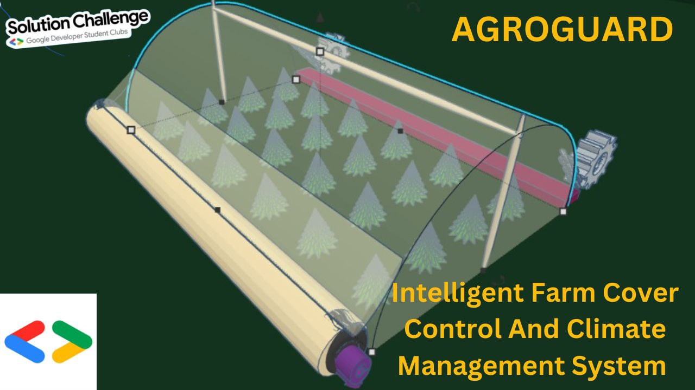

<h1>AGROGUARD-Intelligent Farm Cover Control And Climate Management System</h1>
  

This pioneering agricultural project introduces an intricately integrated system that harnesses IoT technology and automation to  
transform traditional farming practices. The system relies on a network of sensors to continuously gather real -time data on  
temperature and humidity, as well as rain conditions within the agricultural environment. A central data hub, equipped with  
advanced data analysis capabilities, processes this data and historical information to facilitate informed and proactive decision- 
making. 
Sophisticated control algorithms govern critical components such as the motorized pulley system and irrigation, ensuring efficient  
crop protection and resource management. Operating as a highly adaptive and responsive system, it maintains a feedback loop to  
monitor the effects of its actions and alert farmers to critical conditions. The project provides a user-friendly interface for farmers to  
customize settings, track system activities, and intervene when necessary. 
Incorporating machine learning and AI, the system continually enhances control strategies, enhancing efficiency and sustainability.  
This integrated approach significantly reduces the need for manual intervention, effectively responding to dynamic weather  
conditions and optimizing crop yields while promoting responsible resource utilization. This innovation represents a significant  
advancement in modern agriculture, poised to benefit farmers and the environment. 
Keywords: Agriculture, IoT (Internet of Things), Automation, Crop protection, Resource management, Sustainability, Weather data,  
Cloud-based decision-making, Motorized pulley system, Sensor technology, Efficiency, Yield optimization, Environmental sensors,  
Adaptive control, Green energy, Manual control, Farming practices, Responsive technology, Sustainable agriculture, Environmental  
impact.

